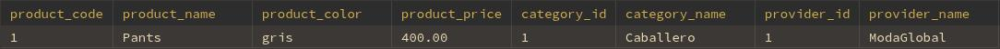

# Lo que pidio el Control O
### Proyecto 3: Tienda de Ropa - Claudio Castro

### Nombre del proyecto: ModaStore

**Módulos**:
- Control de acceso (roles: administrador, vendedor)
- Productos (ropa, tallas, colores, precios, stock)
- Clientes (registro de compradores, historial de compras)
- Ventas (factura, fecha, productos vendidos)
- Inventario (stock por categoría, alertas de bajo stock)
- Proveedores (contacto, productos ofrecidos)
- Reportes (ventas, productos más vendidos, inventario)

**TODO**
- Ventas no afectadas por cambio de precio en producto
- Trigger para actualizar stock en cada venta

# Explicación
## Contenido de Base de datos
- **Diagrama Entidad Relación**


## Procedures
**Nota**
- Los parametros nulos se envian de la siguiente manera: 
  - sp_ejemplo(NULL)
- Todos los deletes son bajas lògicas

El formato de de explicacion de de cada procedure es de la siguiente forma:

#### <u>sp_Nombre_del_Procedure</u>
- Parametros:
  - Nombre_de_parametro:
    - tipo de dato
    - **`NOT NULL`**/**`NULL`**
- Ejemplo:
  - `Ejemplo de procedure para ejecutar`
imagen de resultado (solo para procedures de tipo SELECT)


### Ventas
#### <u>sp_Sales_Report</u>
- Parametros:
  - start_date:
    - DATE
    - **`NULL`**
  - end_date:
    - DATE
    - **`NULL`**
- Ejemplo:
  - `CALL sp_Sales_Report('2023-10-01', '2023-10-30');`


#### <u>sp_Sale_Detail</u>
- Parametros:
  - id_to_search:
    - INT
    - **`NOT NULL`**
- Ejemplo:
  - `CALL sp_Sale_Detail(1);`
  - Datos de Venta
  - 
  - Productos Vendidos
  - 

### Ventas
#### <u>sp_Insert_Sale</u>
- Parametros:
  - v_sale_invoice_num 
    - INT
    - **`NULL`**
  - v_sale_date 
    - DATE
    - **`NULL`**
  - v_customer_id 
    - INT
    - **`NULL`**
  - v_products_sold 
    - JSON
    - **`NULL`**
- Ejemplo:
  ```sql
    CALL sp_Insert_Sale(
      112,
      '2023-10-04',
      1,
      '[
          {"product_id": 1,"product_quantity": 2},
          {"product_id": 3,"product_quantity":1}
    ]'
  ); 
  ```

#### <u>sp_Delete_Sale</u>
- Parametros:
  - id_to_seatch:
    - INT
    - **`NOT NULL`**
- Ejemplo:
  - `sp_Delete_Sale(1)`


**Nota**: 
- Las fechas se deben enviar en formato `AAAA-MM-DD` entre comillas '', 
  - Ejemplo: `2023-10-01`

---
### Productos
#### </u>sp_Stock_Report</u>
- Parametros:**`NULL`**
  - category_id_to_search
    - INT
    - 
  - min_stock
    - INT
    - **`NULL`**
  - max_stock
    - INT
    - **`NULL`**
- Ejemplo:
  - `sp_Stock_Report(1, 20, 30)`


#### <u>sp_Product_Detail</u>
- Parametros:
  - id_to_search:
    - INT
    - **`NOT NULL`**
- Ejemplo:
  - `CALL sp_Product_Detail(1);`
  - Datos del Producto
  - 
  - Stock por tallas del Producto
  - 

#### <u>sp_Insert_Product</u>
- Parametros:
  - v_product_name
    - VARCHAR(30)
    - **`NOT NULL`**
  - v_product_color 
    - VARCHAR(30)
    - **`NOT NULL`**
  - v_product_price 
    - DECIMAL(7, 2) //Máximo de 7 caracteres y 2 decimas
    - **`NOT NULL`**
  - v_product_stock_S 
    - INT
    - **`NULL`**
  - v_product_stock_M 
    - INT
    - **`NULL`**
  - v_product_stock_L 
    - INT
    - **`NULL`**
  - v_provider_id 
    - INT
    - **`NOT NULL`**
  - v_category_id
    - INT
    - **`NOT NULL`**
- Ejemplo:
  ```sql
    CALL sp_Insert_Product(
      'Camisa',
      'Azul',
      19.99,
      10,
      5,
      8,
      1,
      1
    );
  ```

#### <u>sp_Update_Product</u>
- Parametros:
    - v_product_code
      - INT
      - **`NOT NULL`**
    - v_product_name
      - VARCHAR(30)
      - **`NOT NULL`**
    - v_product_color
      - VARCHAR(30)
      - **`NOT NULL`**
    - v_product_price
      - DECIMAL(7, 2)
      - **`NOT NULL`**
    - v_product_stock_S
      - INT
      - **`NULL`**
    - v_product_stock_M
      - INT
      - **`NULL`**
    - v_product_stock_L
      - INT
      - **`NULL`**
    - v_provider_id
      - INT
      - **`NOT NULL`**
    - v_category_id
      - INT
      - **`NOT NULL`**
- Ejemplo:
  ```sql
    CALL sp_Update_Product(
      5,
      'Camisa Actualizada',
      'Rojo',
      24.99,
      12,
      6,
      10,
      1,
      1
    );
  ```
#### <u>sp_Delete_Product</u>
- Parametros:
  - id_to_search:
    - INT
    - **`NOT NULL`**
- Ejemplo:
  - `CALL sp_Delete_Product(1);`

