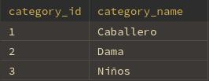

## Categorías

### sp_Category_List
#### Parámetros:
- *(ninguno)*

#### Ejemplo:
```sql
CALL sp_Category_List();
````

* Lista de categorías activas
* 

---

### sp\_Insert\_Category

#### Parámetros:

* v\_category\_name

  * VARCHAR(30)
  * **`NOT NULL`**

#### Ejemplo:

```sql
CALL sp_Insert_Category('Ropa deportiva');
```

---

### sp\_Update\_Category

#### Parámetros:

* v\_category\_id

  * INT
  * **`NOT NULL`**
* v\_category\_name

  * VARCHAR(30)
  * **`NOT NULL`**

#### Ejemplo:

```sql
CALL sp_Update_Category(1, 'Ropa formal');
```

---

### sp\_Delete\_Category

#### Parámetros:

* id\_to\_search

  * INT
  * **`NOT NULL`**

#### Ejemplo:

```sql
CALL sp_Delete_Category(1);
```


