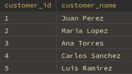
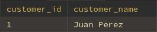
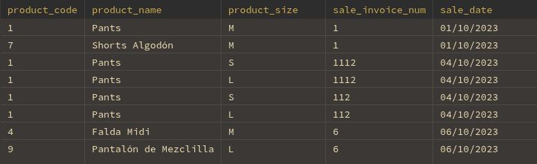

## Clientes

### sp_Customer_List
#### Parámetros:
- *(ninguno)*

#### Ejemplo:
```sql
CALL sp_Customer_List();
```
- Lista de clientes activos
- 

---

### sp_Customer_Detail
#### Parámetros:
- search_id:
  - INT  
  - **`NOT NULL`**

#### Ejemplo:
```sql
CALL sp_Customer_Detail(1);
```
1. Datos del cliente
- 
2. Historial de productos comprados
- 

---

### sp_Insert_Customer
#### Parámetros:
- v_customer_name  
  - VARCHAR(30)  
  - **`NOT NULL`**

#### Ejemplo:
```sql
CALL sp_Insert_Customer('Carlos Martínez');
```

---

### sp_Update_Customer
#### Parámetros:
- v_customer_id  
  - INT  
  - **`NOT NULL`**
- v_customer_name  
  - VARCHAR(30)  
  - **`NOT NULL`**

#### Ejemplo:
```sql
CALL sp_Update_Customer(1, 'Carlos M. Actualizado');
```

---

### sp_Delete_Customer
#### Parámetros:
- id_to_search  
  - INT  
  - **`NOT NULL`**

#### Ejemplo:
```sql
CALL sp_Delete_Customer(1);
```
