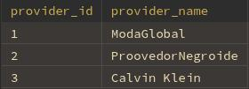
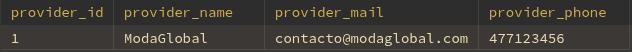
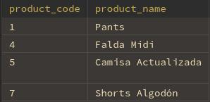

## Proveedores

### sp_Provider_List
#### Parámetros:
- *(ninguno)*

#### Ejemplo:
```sql
CALL sp_Provider_List();
```
- Lista de proveedores activos
- 

---

### sp_Provider_Detail
#### Parámetros:
- id_to_search:
  - INT  
  - **`NOT NULL`**

#### Ejemplo:
```sql
CALL sp_Provider_Detail(1);
```
1. Datos del proveedor
- 
2. Productos asociados
- 

---

### sp_Insert_Provider
#### Parámetros:
- v_provider_name  
  - VARCHAR(30)  
  - **`NOT NULL`**
- v_provider_mail  
  - VARCHAR(30)  
  - **`NOT NULL`**
- v_provider_phone  
  - VARCHAR(10)  
  - **`NOT NULL`**

#### Ejemplo:
```sql
CALL sp_Insert_Provider(
  'Distribuidora Sol',
  'contacto@sol.com',
  '5551234567'
);
```

---

### sp_Update_Provider
#### Parámetros:
- v_provider_id  
  - INT  
  - **`NOT NULL`**
- v_provider_name  
  - VARCHAR(30)  
  - **`NOT NULL`**
- v_provider_mail  
  - VARCHAR(30)  
  - **`NOT NULL`**
- v_provider_phone  
  - VARCHAR(10)  
  - **`NOT NULL`**

#### Ejemplo:
```sql
CALL sp_Update_Provider(
  1,
  'Distribuidora Sol Actualizada',
  'nuevo@sol.com',
  '5557654321'
);
```

---

### sp_Delete_Provider
#### Parámetros:
- id_to_search  
  - INT  
  - **`NOT NULL`**

#### Ejemplo:
```sql
CALL sp_Delete_Provider(1);
```
