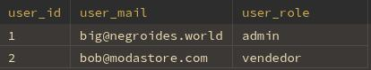
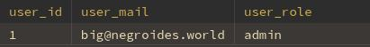

## Usuarios

### sp_User_List
#### Parámetros:
- search_role:
  - VARCHAR(30)
  - **`NULL`** *(filtra por rol si se proporciona)*

#### Ejemplo:
```sql
CALL sp_User_List('admin');
```
- Lista de usuarios activos
- 

---

### sp_User_Detail
#### Parámetros:
- search_id:
  - INT  
  - **`NOT NULL`**

#### Ejemplo:
```sql
CALL sp_User_Detail(1);
```
- Detalles del usuario
- 

---

### sp_Insert_User
#### Parámetros:
- v_user_mail  
  - VARCHAR(50)  
  - **`NOT NULL`**
- v_user_password  
  - VARCHAR(10)  
  - **`NOT NULL`**
- v_user_role  
  - VARCHAR(30)  
  - **`NOT NULL`**

#### Ejemplo:
```sql
CALL sp_Insert_User(
  'usuario@correo.com',
  'contrasena1',
  'vendedor'
);
```

---

### sp_Update_User
#### Parámetros:
- v_user_id  
  - INT  
  - **`NOT NULL`**
- v_user_mail  
  - VARCHAR(50)  
  - **`NOT NULL`**
- v_user_password  
  - VARCHAR(10)  
  - **`NOT NULL`**
- v_user_role  
  - VARCHAR(30)  
  - **`NOT NULL`**


#### Ejemplo:
```sql
CALL sp_Update_User(
  1,
  'nuevo@correo.com',
  'nuevopass',
  'admin'
);
```

---

### sp_Delete_User
#### Parámetros:
- id_to_search  
  - INT  
  - **`NOT NULL`**

#### Ejemplo:
```sql
CALL sp_Delete_User(1);
```
