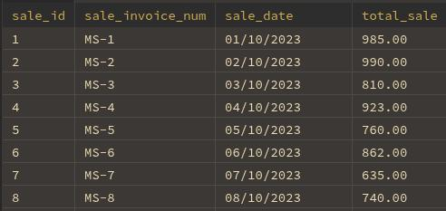
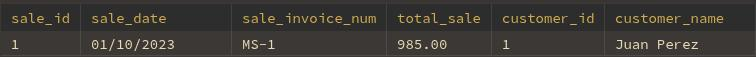
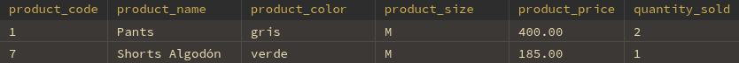

## Ventas
### sp_Sales_Report
#### Parametros:
- start_date:
  - DATE
  - **`NULL`**
- end_date:
  - DATE
  - **`NULL`**
#### Ejemplo:
- ```sql
  CALL sp_Sales_Report('2023-10-01', '2023-10-30');
  ```
- 

---

### sp_Sale_Detail
#### Parametros:
- id_to_search:
  - INT
  - **`NOT NULL`**
#### Ejemplo:
```sql
  CALL sp_Sale_Detail(1);
```
1. Datos de Venta
- 
2. Productos Vendidos
- 

---

### sp_Insert_Sale
#### Parametros:
- v_sale_date 
  - DATE
  - **`NULL`**
- v_customer_id 
  - INT
  - **`NULL`**
- v_products_sold 
  - JSON
  - **`NULL`**
#### Ejemplo:
  ```sql
    CALL sp_Insert_Sale(
      '2023-10-04',
      1,
      '[
          {"product_id": 1,"product_quantity": 2},
          {"product_id": 3,"product_quantity":1}
    ]'
  ); 
  ```

---

### sp_Delete_Sale
#### Parametros:
- id_to_search:
  - INT
  - **`NOT NULL`**
#### Ejemplo:
- ```sql
  CALL sp_Delete_Sale(1);
  ```


### Nota: 
- Las fechas se deben enviar en formato `AAAA-MM-DD` entre comillas `''` , 
  - Ejemplo: `'2023-10-01'`